# Themes

Each theme lives in its own subdirectory under `themes/` and is selected via the `theme` config key (e.g. `"theme": "clown"`). All themes support both portrait and landscape display orientations automatically.

## theme.json format

| Key | Type | Description |
|---|---|---|
| `display_name` | string | Name shown on the LCD header |
| `menu_title` | string | Name shown in the menu system |
| `web_title` | string | Name shown in the web UI title |
| `bg_color` | [R, G, B] | Background color |
| `text_color` | [R, G, B] | Primary text color |
| `accent_color` | [R, G, B] | Accent / secondary color |
| `animation_mode` | string | `"random"` or `"sequential"` frame selection |
| `image_display_delaymin` | number | Minimum seconds between animation frame changes |
| `image_display_delaymax` | number | Maximum seconds between animation frame changes |
| `comment_delaymin` | number | Minimum seconds between LCD comment updates |
| `comment_delaymax` | number | Maximum seconds between LCD comment updates |
| `title_font_color` | [R, G, B] | Title text color (defaults to `text_color`) |
| `title_font_size` | number | Title font size in pixels (defaults to layout value) |

## Delay values and the override toggle

Themes can define their own timing for animation frames and comment updates using the four delay keys above. When a theme provides these values, they take priority over the global config defaults.

If the `Override Theme Animation Delays` toggle is enabled in the web UI config (config key: `override_theme_delays`), the global config values for `image_display_delaymin`, `image_display_delaymax`, `comment_delaymin`, and `comment_delaymax` are used instead, regardless of what the theme defines.

**Priority order:**
1. If `override_theme_delays` is **on** -- global config values are always used
2. If `override_theme_delays` is **off** (default) -- theme values are used when present, otherwise global config values are used as a fallback

## Optional theme assets

Themes can also override fonts, images, and comments by placing files in the expected subdirectories:

- `fonts/title.TTF` -- title font override
- `images/` -- static icon overrides (e.g. `target.png`, `frise.png`)
- `images/status/<action>/` -- character animation frame overrides
- `comments/comments.json` -- dialogue text override

## Available Themes

| Theme | Directory | Author |
|---|---|---|
| Bjorn | `bjorn` | Infinition (default) |
| ClownSec | `clown` | brAinphreAk |
| Cap'n Plndr | `pirate` | brAinphreAk |
| Sir Haxalot | `knight` | Zombie Joe |

## Screenshots

### ClownSec

| | | | |
|---|---|---|---|
| 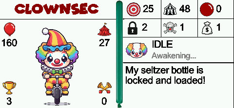 | 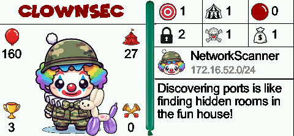 | 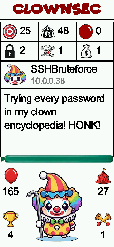 | 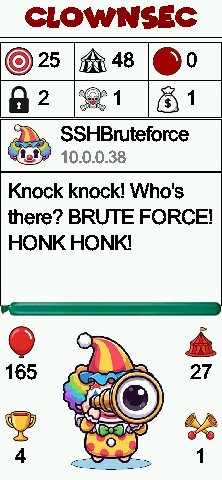 |

### Sir Haxalot (Knight)

| | | | |
|---|---|---|---|
| 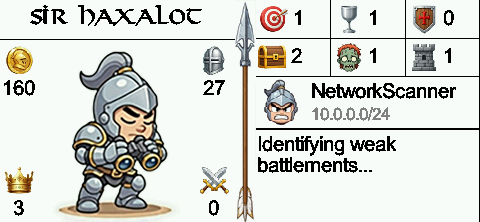 | 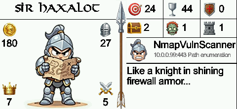 | 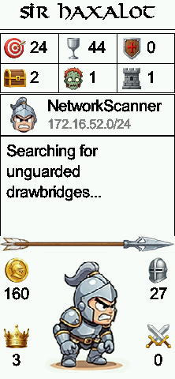 | 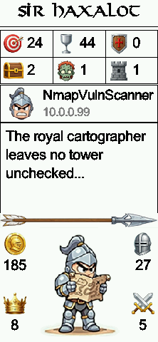 |

### Cap'n Plndr (Pirate)

| | | | |
|---|---|---|---|
| 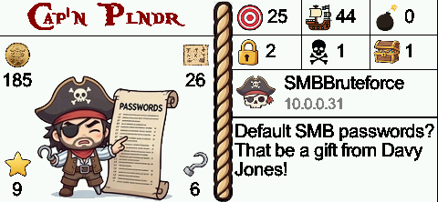 | 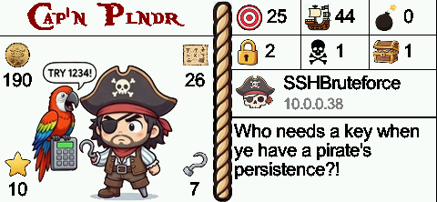 | 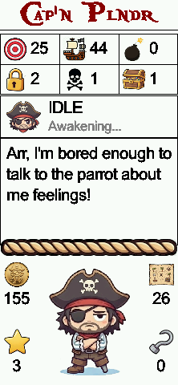 | 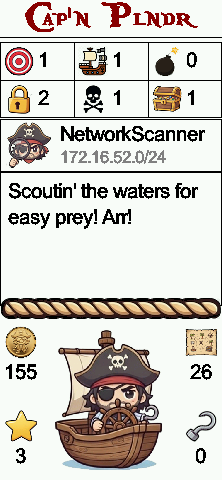 |
